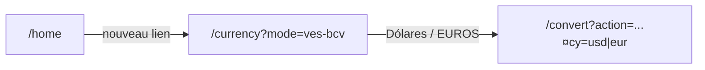

# Plan : saisie en bolívares → USD/EUR (tasa BCV)

## Contexte technique

- Le taux BCV chargé par [`useBcvRate`](app/convert/hooks/use-bcv-rate.ts) / [`getBcvRate`](lib/bcv-rate.ts) est utilisé comme **VES par 1 USD ou 1 EUR** (cf. [`useConvertForm`](app/convert/hooks/use-convert-form.ts) : `result = amountN * effectiveRate` en bolívares).
- **Conversion inverse** : `montantVES / refPrice` = montant en USD ou EUR.

## Comportement attendu

- **Pas** de mode particulier ni flux unifié pour ce cas : uniquement BCV, comme demandé initialement.
- **Deux monnaies cibles** : même mécanisme que le reste de l’app (`currency=usd` | `eur`).

## 1. Flux et URLs — [`lib/flow.ts`](lib/flow.ts)

- Ajouter un slug d’action dédié, par ex. `convert-bcv-from-ves` (nom explicite côté code).
- L’inclure dans le type `ActionSlug`, le tableau `ACTIONS` (libellé espagnol), et la fonction `isActionSlug`.
- Ajouter une constante de mode pour l’étape monnaie, par ex. `CURRENCY_VES_BCV_MODE = "ves-bcv"`, avec `isVesBcvMode()` et **`currencyVesBcvHref()`** → `/currency?mode=ves-bcv`.
- **`currencyStepHref`** : pour `convert-bcv-from-ves`, renvoyer `currencyVesBcvHref()` (retour depuis `/convert` vers le bon intermédiaire).
- **`currencyPageEyebrow`** / **`convertPageEyebrow`** : ajouter des libellés cohérents (ex. BCV, bolívares → monnaie cible).
- Optionnel : petite fonction **`convertPageHeadingFromVes()`** (ou texte inline dans le client) pour le titre du formulaire (ex. montant en Bs.S), pour ne pas confondre avec « ¿Cuánto quieres convertir? » centré sur la devise étrangère.

## 2. Page choix de monnaie — [`app/currency/page.tsx`](app/currency/page.tsx)

- Après la gestion de `mode=convert` (et le redirect `channel` existant), traiter **`isVesBcvMode(modeRaw)`** :
  - Même structure que le bloc unifié (BackNav → `/home`, sous-titre, titre [`currencyPageHeading()`](lib/flow.ts)).
  - Liens vers `/convert?action=convert-bcv-from-ves&currency=usd` et `currency=eur`, avec les mêmes styles emerald/indigo que les boutons USD/EUR actuels.

## 3. Accueil — [`app/home/page.tsx`](app/home/page.tsx)

- Ajouter un **`HomeActionLink`** (ou équivalent) pointant vers **`currencyVesBcvHref()`**, avec texte espagnol du type « Bolívares → dólares/euros (BCV) » / « Tasa BCV », aligné visuellement sur les cartes existantes.

## 4. Logique formulaire — [`app/convert/hooks/use-convert-form.ts`](app/convert/hooks/use-convert-form.ts)

- Si `action === "convert-bcv-from-ves"` :
  - Interpréter **`amount`** comme montant en **bolívares** (validation inchangée via `parseAmount`).
  - **Ne pas** afficher le champ particulier (`showPrivateField === false`).
  - Calcul : `result = amountN !== null && refPrice !== null && refPrice > 0 ? amountN / refPrice : null`.
  - Adapter **`copyConvertedBs`** (renommer ou brancher) pour copier le **montant en fiat** avec le bon formatage, pas `formatBsPlain`.

## 5. UI — [`app/convert/convert-client.tsx`](app/convert/convert-client.tsx)

- Pour `convert-bcv-from-ves` :
  - Libellé du champ : montant en **Bs.S** / bolívares (suffixe visuel cohérent avec l’existant).
  - Bloc résultat : formule du type « Bs.S ÷ tasa BCV → **USD/EUR** », message d’erreur si taux absent ou ≤ 0, états chargement identiques à aujourd’hui.
  - Pas de branches unifiée / particulier pour cet `action`.

## 6. Formatage — [`app/convert/lib/convert-format.ts`](app/convert/lib/convert-format.ts)

- Ajouter **`formatFiat(n, unit: "USD" | "EUR")`** (et variante **plain** pour le presse-papiers, `useGrouping: false` si on suit le modèle `formatBsPlain`).

## Fichiers non modifiés (si pas besoin)

- Routes API : pas de nouvel endpoint ; réutilisation du fetch BCV déjà utilisé côté client.
- [`use-convert-route-params.ts`](app/convert/hooks/use-convert-route-params.ts) : aucun changement si le nouveau slug est pris en charge par `isActionSlug`.

## Vérification manuelle

- Lien accueil → choix USD → saisie bolívares → résultat USD cohérent avec une division manuelle par le taux affiché ailleurs (bandeau / ticker).
- Même chose pour EUR.
- Retour arrière depuis `/convert` vers `/currency?mode=ves-bcv`.
